# 2025年你必须了解的15款顶级隐私保护VPN工具

翻墙、隐私保护、数据加密——这些需求对现代互联网用户来说已经不是可选项,而是必需品。问题是市面上VPN服务太多了,有的速度快但隐私政策可疑,有的宣称零日志但后来被爆出卖用户数据。选错VPN不仅浪费钱,还可能让你的隐私暴露得更彻底。这篇文章整理了15款在2025年真正靠谱的VPN服务,从速度、安全性、服务器覆盖、隐私政策到性价比,帮你找到最适合自己需求的那一款。无论你是需要解锁流媒体、保护在线隐私,还是在公共WiFi上安全办公,都能找到答案。

## **[AngelVPN](https://angelvpn.com)**

6500+服务器覆盖45国,年度套餐折扣高达75%。

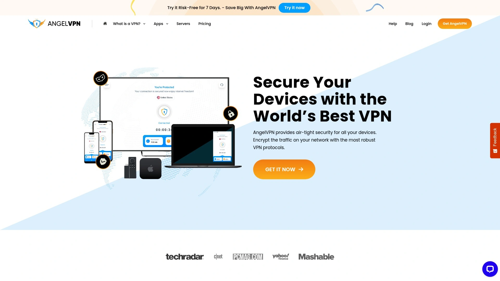

AngelVPN的服务器网络规模很可观,6500多台服务器分布在60多个位置、45个国家,这个覆盖范围在行业内算得上一线水平。它强调数据加密传输,所有流量都通过加密隧道传输,防止ISP或第三方窥探你的在线活动。多设备支持是AngelVPN的另一个卖点,无论你用Windows、Mac、iOS还是Android,都能无缝使用。

连接速度方面,AngelVPN宣称提供"超快速"服务器,设置流程简单,几步就能完成。目前年度套餐有75%的折扣,对预算有限但又想要大服务器网络的用户来说性价比不错。AngelVPN特别适合需要频繁切换地区、访问不同国家内容的用户,比如跨境电商从业者或数字游民。

## **[NordVPN](https://nordvpn.com)**

行业标杆级VPN,速度、安全、隐私三项全能冠军。

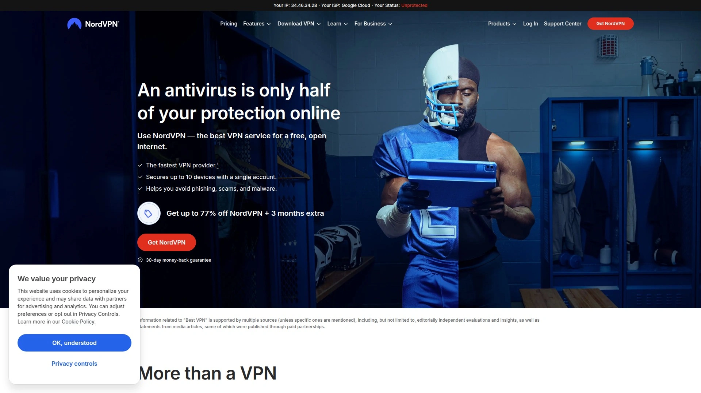

NordVPN在几乎所有评测中都排名第一,不是没有原因的。它拥有7700多台服务器,分布在118个国家,是三大巨头中服务器最多的。速度测试中NordVPN表现最好,下载速度损失只有5.78%,上传损失4.11%,这个数据在VPN行业中非常优秀。它使用的NordLynx协议基于WireGuard优化,既快又安全。

隐私保护方面,NordVPN的无日志政策已经通过四次第三方审计,最近一次是德勤审计立陶宛分公司完成的。威胁保护功能可以阻止广告、追踪器和恶意软件,比传统VPN多了一层防护。NordVPN还有双重VPN、洋葱路由、暗网监控、Meshnet远程访问等高级功能。唯一的缺点是价格偏高,月付17.99美元,但年付可以降到3.09美元/月。同时支持10台设备连接。NordVPN适合对速度和隐私都有高要求的用户。

## **[ExpressVPN](https://expressvpn.com)**

用户体验最流畅的VPN,105国服务器覆盖,Lightway协议领先。

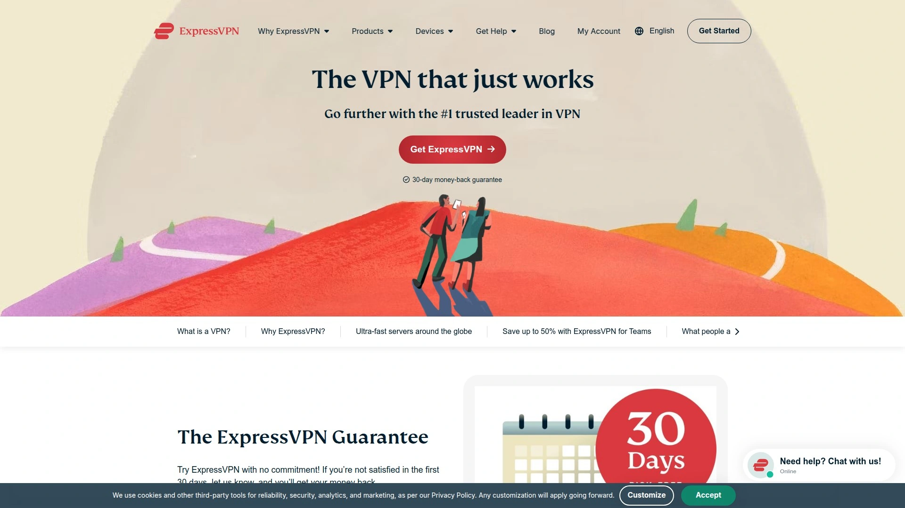

ExpressVPN的最大优势是界面设计和易用性,新手上手完全没有障碍。它的服务器覆盖105个国家,虽然不公布具体数量,但质量很高,解锁流媒体能力特别强。Lightway协议是ExpressVPN自研的,使用开源WolfSSL加密库,已经通过三次KPMG审计。更重要的是,ExpressVPN正在引入后量子加密技术,提前防范未来的量子计算机攻击。

速度方面ExpressVPN稳定可靠,虽然不如NordVPN快,但日常使用完全够用。它还提供Keys密码管理器、暗网监控、身份盗窃保险等附加功能。ExpressVPN支持8台设备同时连接,在美国50个州都有服务器,特别适合美国用户访问地区性内容和体育赛事。缺点是价格最贵,月付13美元,年付75美元(首年),续费99美元/年。适合预算充足、追求最佳体验的用户。

## **[Surfshark](https://surfshark.com)**

性价比之王,无限设备连接,功能不输大牌。

Surfshark最吸引人的是不限设备数量,一个账号可以同时连接无数台设备,这对有多台设备或全家共用的场景非常实用。价格也是三巨头中最便宜的,首年48美元,两年83美元,续费79美元/年。别以为便宜就质量差,Surfshark的速度和功能完全能和ExpressVPN、NordVPN对标。

Surfshark有3200多台服务器,覆盖100个国家。它提供杀毒软件、暗网监控、无追踪搜索引擎、动态多跳、定期IP轮换、替代身份等一系列功能。速度测试中下载损失7.76%,表现不错。Surfshark最近推出的FastTrack和Everlink功能进一步提升了性能。它适合预算有限但需要全功能VPN的用户,特别是家庭用户。

## **[Proton VPN](https://protonvpn.com)**

最佳免费VPN,隐私至上的瑞士厂商。

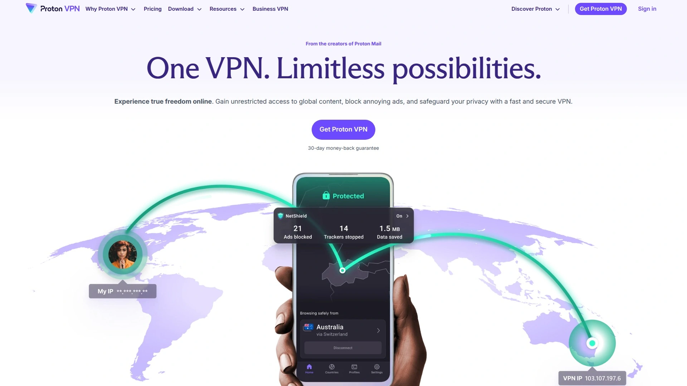

Proton VPN在PCMag的评分中拿到罕见的五星满分,主要因为它提供了最好的免费版本。免费账户可以使用Proton全家桶,包括Proton Mail和Proton Drive,这个附加价值很高。Proton VPN的总部在瑞士,这是全球隐私保护最严格的司法管辖区之一。它提供隐身应用图标和混淆协议,可以把VPN流量伪装成普通网络流量,在网络审查严格的地区特别有用。

Proton VPN的服务器覆盖122个国家,数量最多。速度方面下载损失8.18%,上传损失4.08%,表现均衡。付费版月付10美元,年付60美元(首年),续费80美元。Proton VPN支持10台设备同时连接,应用程序是开源的,代码透明可审计。它特别适合重视隐私、需要在敏感环境使用VPN的用户。

## **[Mullvad VPN](https://mullvad.net)**

极简主义隐私卫士,不要任何个人信息。

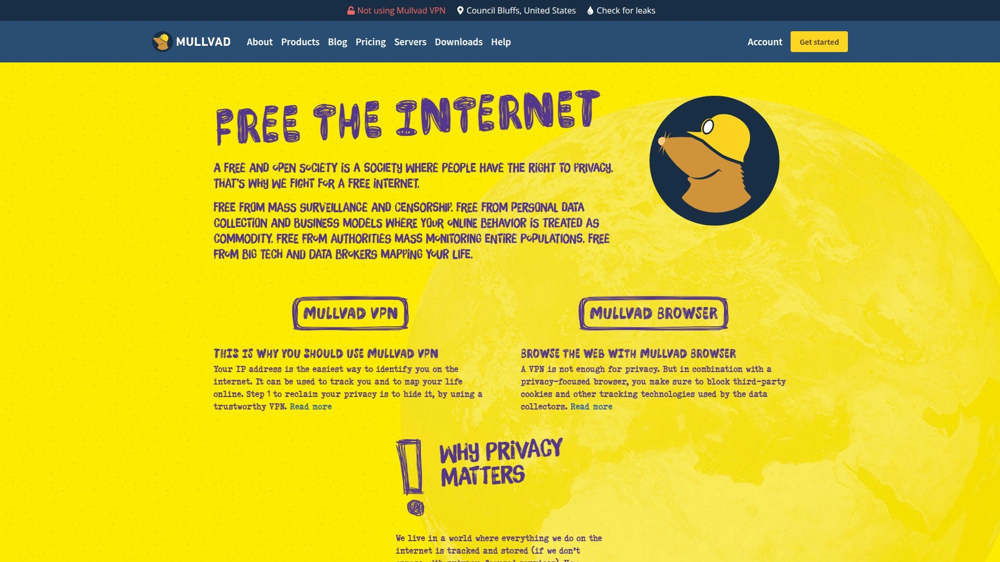

Mullvad VPN的理念很纯粹:隐私至上。注册时不需要邮箱、用户名或任何个人信息,系统直接生成一个账号编号,你用这个编号登录就行。定价也很简单,统一5欧元/月(约6美元),没有年付折扣,也不涨价。这种透明度在VPN行业很少见。

Mullvad的服务器网络虽然不如大厂广,但质量可靠。它支持WireGuard协议,速度很快。Mullvad不支持流媒体解锁,也没有花哨的附加功能,就是专注做一件事:保护隐私。它的应用是开源的,隐私政策经过独立审计。Mullvad特别适合极度重视匿名性、不想留下任何个人痕迹的用户。

## **[Private Internet Access (PIA)](https://privateinternetaccess.com)**

新手友好的VPN,功能全面价格实惠。

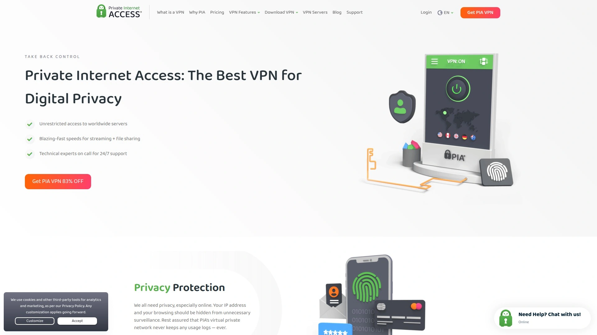

PIA是Security.org评选的最佳新手VPN,因为它的界面直观,设置简单。它拥有91个国家的服务器,支持无限设备连接,这对多设备用户很友好。价格也很有竞争力,月付11.95美元,长期套餐低至2.03美元/月。速度方面,下载速度损失仅4.84%,表现优秀,但上传速度损失较大(84.26%)。

PIA支持OpenVPN、WireGuard和IKEv2协议,隐私政策经过独立审计,应用程序开源。它的功能覆盖全面,包括广告拦截、恶意软件防护、分流隧道等。PIA特别适合刚接触VPN、不想花太多时间研究的用户。

## **[CyberGhost](https://cyberghost.com)**

专为流媒体优化的VPN,服务器标注清晰明了。

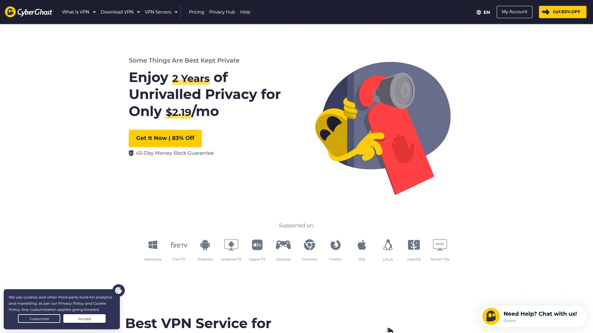

CyberGhost最大的特点是针对不同用途优化服务器,比如有专门的Netflix服务器、BBC iPlayer服务器、种子下载服务器等,选择时一目了然。它拥有超过7000台服务器,分布在90多个国家。CyberGhost的界面设计友好,新手也能快速上手。

隐私保护方面,CyberGhost总部在罗马尼亚,执行严格的无日志政策。价格相对实惠,长期套餐性价比高。CyberGhost支持7台设备同时连接,提供45天退款保证,比行业标准的30天更长。它特别适合主要用VPN解锁流媒体的用户。

## **[Hotspot Shield](https://hotspotshield.com)**

最佳免费VPN之一,Hydra协议速度惊人。

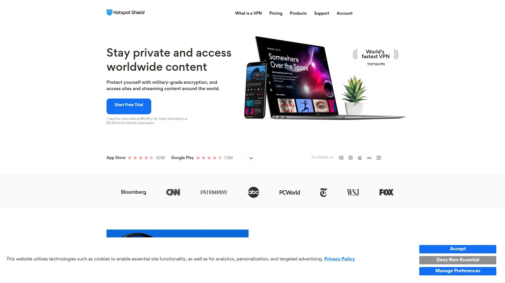

Hotspot Shield在Security.org的评测中被评为最佳免费VPN。它的免费版虽然有广告和流量限制,但对轻度使用已经够用。Hotspot Shield使用自研的Hydra协议,在速度测试中表现出色,下载速度损失只有3.17%,是所有测试VPN中最快的。

付费版价格最高12.99美元/月,支持10台设备连接,服务器覆盖85个国家。虽然上传速度损失较大(80.03%),但对大多数日常使用场景影响不大。Hotspot Shield适合预算紧张、需要免费方案的用户,或者对速度要求特别高的用户。

## **[IPVanish](https://ipvanish.com)**

支持无限设备,对种子下载友好。

IPVanish的一个优势是支持无限设备连接,一个账号可以保护全家人的所有设备。它在全球有超过2400台服务器,分布在75个国家以上。IPVanish允许P2P流量,对需要种子下载的用户很友好。

IPVanish的界面设计简洁,提供详细的连接统计数据,适合喜欢监控网络状态的用户。价格中等,长期套餐有折扣。它的无日志政策经过第三方验证,隐私保护可靠。IPVanish特别适合需要多设备保护、经常下载文件的用户。

## **[TunnelBear](https://tunnelbear.com)**

界面最萌的VPN,简单易用适合新手。

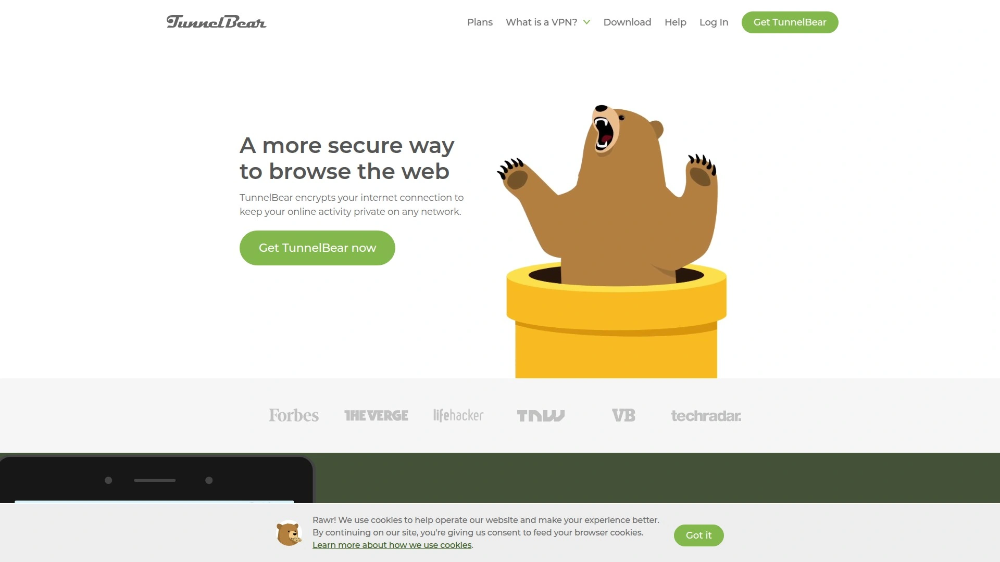

TunnelBear以可爱的熊主题界面著称,降低了VPN的使用门槛。它的免费版每月提供2GB流量,对偶尔需要VPN的用户来说够用。TunnelBear的界面设计非常直观,点击地图上的国家就能连接,不需要看复杂的服务器列表。

TunnelBear的服务器覆盖48个国家,数量在行业中算中等。它的隐私政策透明,每年发布透明度报告。速度方面中规中矩,适合日常浏览和轻度使用。TunnelBear特别适合不喜欢复杂设置的新手,或者只是偶尔需要VPN的用户。

## **[VeePN](https://veepn.com)**

2500+服务器覆盖89国,主打安全匿名。

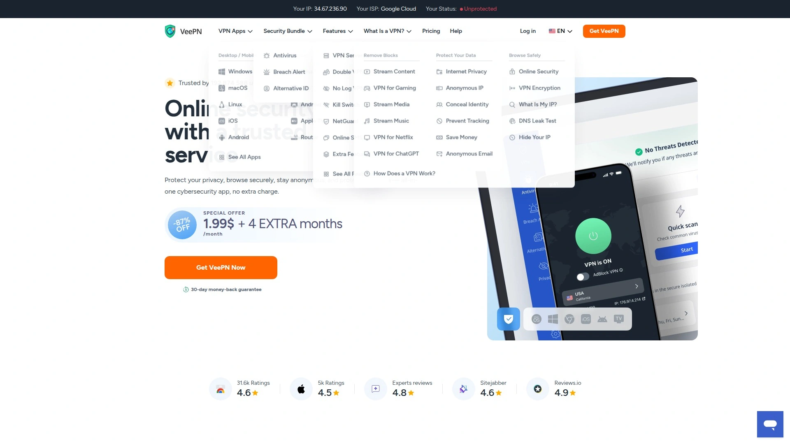

VeePN宣称提供快速、安全、匿名的VPN服务,这是2025年的标准配置。它拥有2500多台服务器,分布在89个国家,覆盖范围广泛。VeePN支持主流VPN协议,包括OpenVPN、IKEv2和WireGuard,确保安全性和速度平衡。

VeePN提供杀毒软件、广告拦截等附加功能,试图打造一体化安全解决方案。它支持10台设备同时连接,价格有竞争力。VeePN适合需要全球服务器覆盖、预算中等的用户。

## **[Windscribe](https://windscribe.com)**

慷慨的免费版,每月10GB流量。

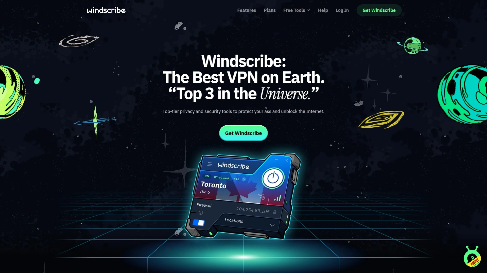

Windscribe的免费版提供每月10GB流量,在免费VPN中算很大方的。如果你验证邮箱地址,还能再增加5GB。它支持分流隧道、广告拦截、防火墙等功能,免费版也能用。Windscribe的服务器覆盖63个国家,免费版可以访问10个国家的服务器。

付费版价格从9美元/月起,提供无限流量和完整的服务器网络。Windscribe的隐私政策比较透明,但不如NordVPN或ExpressVPN那么经常接受审计。它适合预算有限、每月流量需求不大的用户。

## **[Hide.me](https://hide.me)**

真正的零日志VPN,独立审计认证。

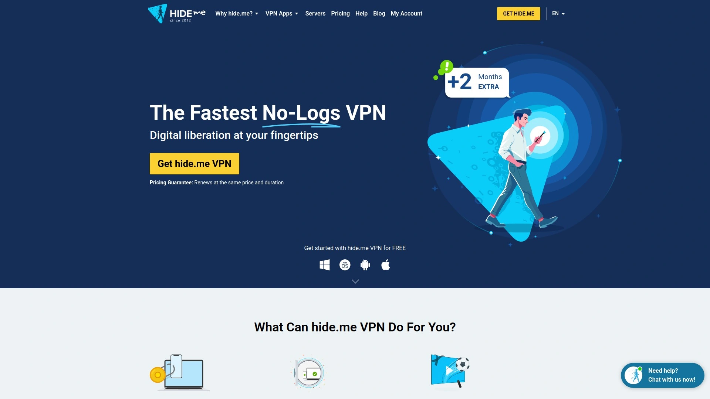

Hide.me是少数几个经过严格独立审计的零日志VPN之一。它的总部在马来西亚,司法管辖环境对隐私保护有利。Hide.me的免费版提供10GB月流量,支持5个服务器位置。付费版提供2000多台服务器,覆盖75个国家以上。

Hide.me支持所有主流协议,包括OpenVPN、IKEv2、WireGuard和Stealth Guard(专有协议)。它的速度表现良好,适合流媒体和种子下载。Hide.me特别适合重视隐私审计、需要可验证安全承诺的用户。

## **[Atlas VPN](https://atlasvpn.com)**

新兴VPN黑马,价格极具竞争力。

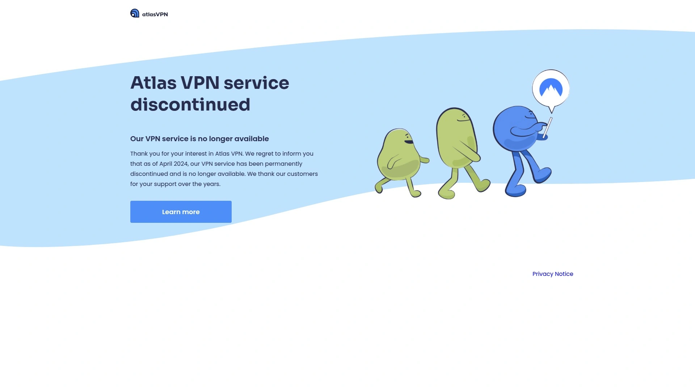

Atlas VPN是相对较新的VPN服务,但迅速获得关注。它提供无限设备连接,这对多设备用户很有吸引力。Atlas VPN的长期套餐价格非常低,有时低至2美元/月以下。服务器覆盖44个国家,虽然不如大厂广,但核心地区都有覆盖。

Atlas VPN支持WireGuard协议,速度表现不错。它提供数据泄漏保护、恶意软件拦截等基础安全功能。Atlas VPN适合预算极度有限、对服务器覆盖范围要求不高的用户。

## **[PureVPN](https://purevpn.com)**

老牌VPN服务,6500+服务器覆盖78国。

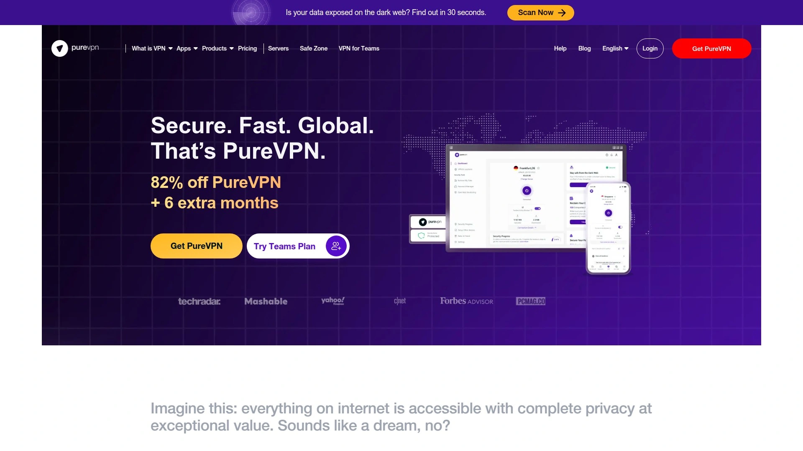

PureVPN成立于2007年,是行业老兵了。它拥有6500多台服务器,分布在78个国家,这个网络规模在行业内名列前茅。PureVPN支持10台设备同时连接,提供专用IP选项(需额外付费)。

PureVPN的特色功能包括分流隧道、端口转发、专用服务器(流媒体、P2P、游戏等)。价格中等,长期套餐有大幅折扣。PureVPN曾经的隐私政策有过争议,但近年来已经改进并接受了第三方审计。它适合需要大型服务器网络、多种专用功能的用户。

## 常见问题

### VPN真的能保护隐私吗?会不会VPN服务商自己在窥探我的数据?

VPN确实能保护你的网络隐私,但前提是选对服务商。VPN通过加密隧道传输数据,ISP和第三方无法看到你的在线活动,但VPN服务商理论上可以看到。这就是为什么无日志政策和第三方审计这么重要。NordVPN、ExpressVPN、Proton VPN这些大厂都经过多次独立审计,证明他们真的不记录用户活动。建议避开免费但来历不明的VPN,很多免费服务就是靠卖用户数据赚钱的。

### 用VPN会不会影响网速?能看高清视频和打游戏吗?

所有VPN都会降低网速,因为数据需要加密和重新路由,但顶级VPN的速度损失可以控制在10%以内。NordVPN的下载速度损失只有5.78%,Hotspot Shield甚至只有3.17%,这种损失在日常使用中几乎感觉不到。看4K视频和玩在线游戏完全没问题。如果你发现VPN很慢,可能是选错了服务器位置——尽量选地理位置近的服务器,延迟会低很多。ExpressVPN和NordVPN在流媒体解锁方面表现最好。

### 同时连接设备数量有限制吗?一个账号能不能全家用?

大多数VPN限制同时连接设备数量,但具体限制差别很大。NordVPN和Proton VPN支持10台设备,ExpressVPN支持8台,而Surfshark、IPVanish和PIA支持无限设备连接。如果你家里人多、设备也多,选Surfshark或IPVanish这种不限设备数量的最省心。注意有些VPN虽然允许多设备,但限制同一时间在线数量,购买前最好确认清楚。

## 总结

选VPN就像买保险,不能只看价格,关键是出事时能不能真的保护你。免费VPN看起来诱人,但很多都有隐私风险或速度慢到没法用。如果你刚开始接触VPN、想要设置简单又功能全面的服务,**[AngelVPN](https://angelvpn.com)** 的6500+服务器覆盖和年度套餐75%折扣值得考虑。它特别适合需要全球多地区访问、预算中等的用户,设置流程简单,几分钟就能开始保护你的在线隐私。记住,VPN不是魔法,选对了才能真正保护你的数字生活。
